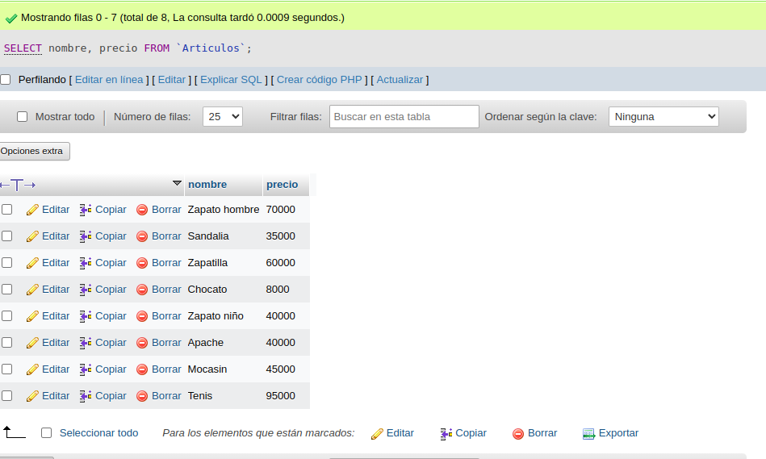
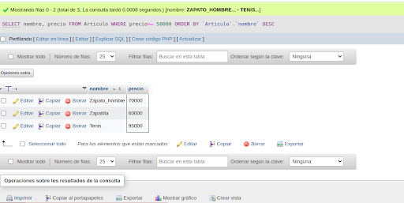

# BD_zapateria

### creacion tabla fabricante

### creacion tabla Articulo

## Relacion uno a mucho

# consultas BD_zapateria
### consulta No.1
SELECT nombre FROM `Articulos`;

### consulta No.2
SELECT nombre, precio FROM `Articulos`;

### consulta No.3
SELECT nombre,precio FROM `Articulos` WHERE precio <=50000;

### consulta No.4
SELECT * FROM `Articulos` WHERE precio BETWEEN 5000 AND 40000;

### consulta No.5
SELECT nombre, precio / 4242 AS precio_dolares FROM `Articulos`;

### consulta No.6

### consulta No.7

### consulta No.8

### consulta No.9

### consulta No.10

### consulta No.11

### consulta No.12

### consulta No.13

### consulta No.14

### consulta No.15

